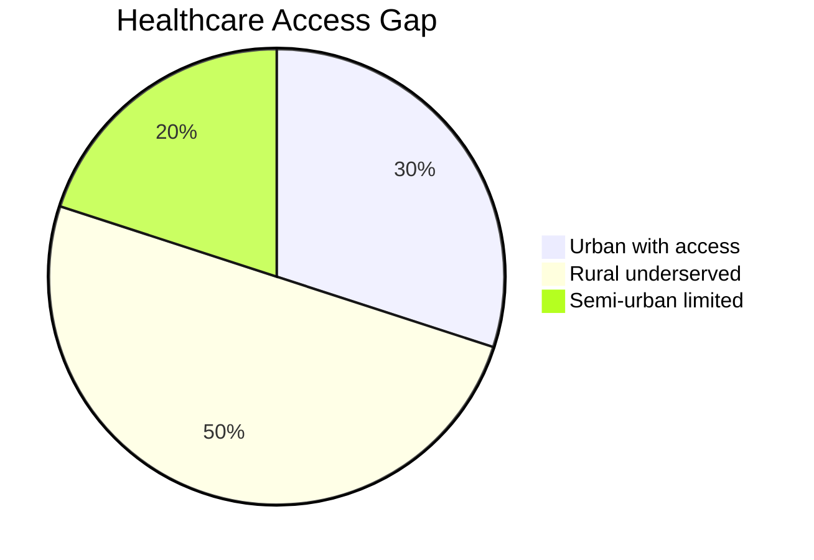
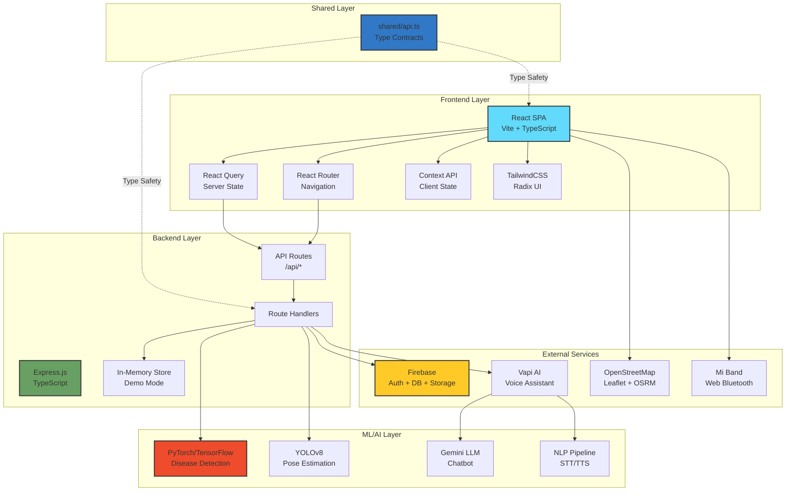
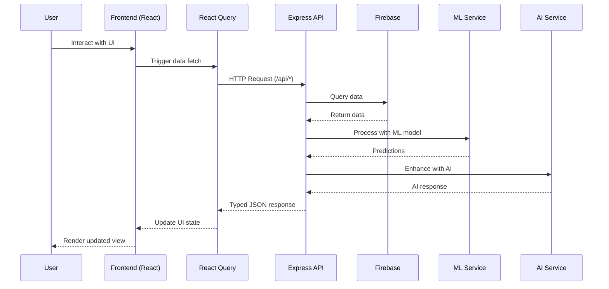
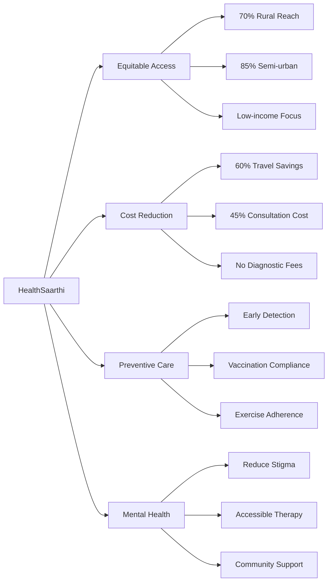

<div align="center">

<!-- Animated Header -->


<h3>🏥 Your AI-Powered Healthcare Companion for Every Indian 🇮🇳</h3>

[](https://www.typescriptlang.org/)
[](https://reactjs.org/)
[](https://nodejs.org/)
[](https://firebase.google.com/)

[](https://github.com/yourusername/healthsaarthi)
[](https://opensource.org/licenses/MIT)
[](http://makeapullrequest.com)
[](https://github.com/yourusername/healthsaarthi/graphs/commit-activity)

<h4>
  <a href="#-quick-start">Quick Start</a>
  <span> · </span>
  <a href="#-features">Features</a>
  <span> · </span>
  <a href="#-architecture">Architecture</a>
  <span> · </span>
  <a href="#-demo">Demo</a>
  <span> · </span>
  <a href="#-documentation">Docs</a>
</h4>

</div>

---

## 📊 Project Status

<div align="center">

| Metric | Status |
|--------|--------|
| 🏗️ **Build** |  |
| 📦 **Version** |  |
| 🧪 **Tests** |  |
| 📈 **Code Coverage** |  |
| ⚡ **Performance** |  |

</div>

---

## 🎯 The Problem We're Solving

<table>
<tr>
<td width="60%">

### 🚨 Healthcare Crisis in India

India's healthcare system struggles with **fragmented primary care**, **late diagnosis**, and **poor preventive health practices**. Communities face:

- ⏱️ **Delayed Detection** - Illnesses diagnosed only when severe
- 🌐 **Language Barriers** - Limited regional language support  
- 💉 **Weak Preventive Care** - Missed vaccinations, poor adherence
- 🚑 **Emergency Delays** - Lack of ambulance coordination
- 🧠 **Neglected Mental Health** - Stigma prevents timely help

> **The Reality**: People seek doctors only when illness is critical. Existing solutions are fragmented. Communities need **one integrated platform**.

</td>
<td width="40%">



### 📉 Impact Stats

- **70%** Late diagnosis cases
- **60%** Lack preventive care
- **45%** Language barriers
- **80%** Mental health stigma

</td>
</tr>
</table>

---

## 💡 Our Solution: HealthSaarthi

<div align="center">

### **The All-in-One Healthcare Ecosystem**

*Practo's Consultation + Mental Health Companion + Exercise Coach + Wearable Hub + ML Disease Detection + Ambulance Tracking + Vaccination Tracker*

#### **9 Powerful Features. 1 Unified Platform. ∞ Lives Impacted.**

</div>

---

## ✨ Core Features

<table>
<tr>
<td width="33%" valign="top">

### 🤖 AI Disease Detection


- 📸 Upload skin/oral/X-ray images
- 🧠 CNN ensemble analysis
- 📊 Instant diagnostic suggestions
- 🎯 Confidence level scoring
- 📱 Mobile-first interface

**Tech**: PyTorch, TensorFlow, Custom CNN

</td>
<td width="33%" valign="top">

### 🚨 Smart Emergency System


- 🚑 One-tap SOS ambulance call
- 📍 Live GPS tracking (Leaflet + OSRM)
- 👨‍👩‍👧 Auto family notifications
- 🗺️ Nearest hospital routing
- ⏱️ ETA calculations

**Tech**: Leaflet.js, OSM, Web Geolocation API

</td>
<td width="33%" valign="top">

### 👨‍⚕️ Telemedicine Console


- 🎥 Secure video calls
- 📝 Real-time transcription
- 📄 Auto-generated PDF reports
- 💊 e-Prescription generation
- 🔒 HIPAA-compliant storage

**Tech**: WebRTC, Firebase, PDF.js

</td>
</tr>

<tr>
<td width="33%" valign="top">

### 🗣️ Multilingual AI Chatbot


- 🌐 Regional language support
- 🎤 Voice-to-text (STT)
- 🔊 Text-to-speech (TTS)
- 🩺 Symptom triage
- 💬 24/7 availability

**Tech**: Vapi AI, Gemini LLM, NLP

</td>
<td width="33%" valign="top">

### 💉 Vaccination Tracker


- 📅 Digital vaccine schedule
- ⏰ Push notifications
- 👪 Family member profiles
- 🏥 Health center integration
- 📊 Completion tracking

**Tech**: React Query, Firebase Cloud Messaging

</td>
<td width="33%" valign="top">

### 🗺️ Doctor Discovery Heatmap


- 📍 Nearby doctor locator
- 🏥 Specialty filtering
- ⭐ Ratings & reviews
- 🕐 Real-time availability
- 📞 Direct booking

**Tech**: Leaflet.js, OpenStreetMap

</td>
</tr>

<tr>
<td width="33%" valign="top">

### 🧠 Mental Health Assessment


- 📋 PHQ-9 depression screening
- 😰 GAD-7 anxiety assessment
- 📈 Risk scoring system
- 🤝 Therapist matching
- 📊 Progress tracking

**Tech**: Standardized clinical frameworks

</td>
<td width="33%" valign="top">

### 🧘 YOLOv8 Exercise Guidance


- 📹 Real-time pose detection
- ✅ Posture correction
- 🔢 Rep counting
- 🧘 Yoga pose validation
- 📊 Workout analytics

**Tech**: YOLOv8, OpenCV, WebRTC

</td>
<td width="33%" valign="top">

### ⌚ Wearable Integration


- 💓 Heart rate monitoring
- 🫁 SpO₂ tracking
- 👟 Step counter
- 😴 Sleep analysis
- 📊 Health dashboards

**Tech**: Web Bluetooth API, Mi Band SDK

</td>
</tr>
</table>

---

## 🏗️ System Architecture

<div align="center">

### **Production-Ready Full-Stack TypeScript Application**

</div>



### **Data Flow Architecture**



---

## 🛠️ Technology Stack

<div align="center">

### **Modern, Type-Safe, Production-Grade Stack**

</div>

### Frontend Technologies

```typescript
// Core Framework
React 18.x          // UI library with concurrent features
TypeScript 5.x      // End-to-end type safety
Vite 5.x            // Lightning-fast build tool

// State Management
React Query         // Server state management
Context API         // Global UI state (MiBand, Sidebar)

// Styling & UI
TailwindCSS         // Utility-first CSS framework
Framer Motion       // Advanced animations
Radix UI            // Accessible component primitives
  └─ Button, Dialog, Toast, Sidebar

// Routing & Navigation
React Router v6     // Client-side routing with SPA support

// Maps & Geolocation
Leaflet.js          // Interactive maps
OpenStreetMap       // Tile provider
OSRM                // Route optimization

// Data Visualization
Recharts            // React charts
Chart.js            // Canvas-based charts
```

### Backend Technologies

```typescript
// Core Server
Node.js 18.x        // Runtime environment
Express.js          // Web framework
TypeScript          // Type-safe backend

// API Design
RESTful APIs        // Resource-based endpoints
Path Aliases        // Clean imports (@/*, @shared/*)

// Data Storage
Firebase Auth       // User authentication
Firebase Realtime   // Real-time database
Firebase Storage    // File storage
In-Memory Store     // Demo mode data

// Middleware
CORS                // Cross-origin requests
Body Parser         // JSON parsing
Compression         // Response compression
```

### AI/ML Stack

```python
# Deep Learning
PyTorch             # Neural network framework
TensorFlow          # Production ML models
YOLOv8              # Object detection & pose estimation
CNN Ensembles       # Medical image classification

# NLP & Voice
Vapi AI             # Voice assistant platform
Gemini LLM          # Large language model
STT/TTS Engines     # Speech processing
Custom Intent Models # Natural language understanding

# Computer Vision
OpenCV              # Image processing
PIL/Pillow          # Image manipulation
```

### DevOps & Deployment

```yaml
Build Tools:
  - Vite: Client bundling & HMR
  - TSC: TypeScript compilation
  - ESBuild: Fast transpilation

CI/CD:
  - GitHub Actions: Automated testing & deployment
  - Netlify: Serverless deployment option
  - Vercel: Frontend hosting
  - Render/Railway: Container deployment

Development:
  - ESLint: Code linting
  - Prettier: Code formatting
  - Husky: Git hooks
  - TypeScript: Type checking

Monitoring:
  - Lighthouse: Performance audits
  - Web Vitals: UX metrics
```

### Integration Stack

| Integration | Technology | Purpose |
|------------|------------|---------|
| 🔐 **Authentication** | Firebase Auth | Secure user management |
| 💾 **Database** | Firebase Realtime DB | Real-time data sync |
| 📦 **Storage** | Firebase Storage | File uploads (images, PDFs) |
| 🗺️ **Maps** | Leaflet + OSM | Location services |
| 🚑 **Routing** | OSRM | Ambulance route optimization |
| ⌚ **Wearables** | Web Bluetooth API | Mi Band connectivity |
| 🤖 **Voice AI** | Vapi | Conversational interface |
| 🧠 **LLM** | Gemini | Intelligent responses |

---

## 📂 Project Structure

```
healthsaarthi/
├── 📁 client/                    # Frontend application
│   ├── 📁 components/            # Reusable UI components
│   │   ├── ui/                   # Radix UI primitives
│   │   └── features/             # Feature-specific components
│   ├── 📁 pages/                 # Route pages
│   │   ├── AmbulanceServices.tsx
│   │   ├── MiBandConnectivity.tsx
│   │   ├── VaccinationTracker.tsx
│   │   ├── DoctorDiscovery.tsx
│   │   ├── AIChatbot.tsx
│   │   └── HealthAnalytics.tsx
│   ├── 📁 contexts/              # React contexts
│   │   ├── MiBandContext.tsx
│   │   └── SidebarContext.tsx
│   ├── 📁 hooks/                 # Custom React hooks
│   ├── 📁 lib/                   # Utility functions
│   ├── App.tsx                   # Root component
│   └── main.tsx                  # Entry point
│
├── 📁 server/                    # Backend application
│   ├── 📁 routes/                # API route definitions
│   │   ├── vaccines.ts
│   │   ├── reminders.ts
│   │   ├── family.ts
│   │   ├── doctors.ts
│   │   ├── appointments.ts
│   │   └── vapi.ts
│   ├── 📁 handlers/              # Request handlers
│   ├── 📁 middleware/            # Express middleware
│   └── index.ts                  # Server entry point
│
├── 📁 shared/                    # Shared type definitions
│   └── api.ts                    # TypeScript contracts
│
├── 📁 ml-models/                 # AI/ML services
│   ├── disease_detection.py
│   ├── pose_estimation.py
│   └── requirements.txt
│
├── 📁 public/                    # Static assets
├── 📁 dist/                      # Production build
│   ├── client/                   # Built SPA
│   └── server/                   # Built server
│
├── vite.config.ts               # Vite configuration
├── vite.config.server.ts        # Server build config
├── tsconfig.json                # TypeScript config
├── tailwind.config.js           # Tailwind CSS config
├── netlify.toml                 # Netlify deployment
└── package.json                 # Dependencies & scripts
```

---

## 🚀 Quick Start

### Prerequisites

```bash
# Required versions
node >= 18.x
npm >= 9.x
python >= 3.9
```

### Installation & Setup

```bash
# 1️⃣ Clone the repository
git clone https://github.com/yourusername/healthsaarthi.git
cd healthsaarthi

# 2️⃣ Install dependencies
npm install

# 3️⃣ Setup environment variables
cp .env.example .env
# Edit .env with your configuration:
# - Firebase credentials
# - Vapi API key
# - Google Maps API key
# - Other service credentials

# 4️⃣ Install Python dependencies (for ML services)
cd ml-models
pip install -r requirements.txt
cd ..
```

### Development Mode

```bash
# Terminal 1: Start unified dev server (Frontend + Backend)
npm run dev
# Frontend: http://localhost:5173
# Backend API: http://localhost:5173/api/*

# Terminal 2: Start ML services (optional)
cd ml-models
python app.py
# ML API: http://localhost:8000
```

### Production Build

```bash
# Build both client and server
npm run build

# Start production server
npm start
# Server runs on: http://localhost:3000
# Serves both API and static SPA
```

### Available Scripts

| Command | Description |
|---------|-------------|
| `npm run dev` | Start development server with HMR |
| `npm run build` | Build for production |
| `npm start` | Run production server |
| `npm run typecheck` | Run TypeScript type checking |
| `npm run lint` | Lint code with ESLint |
| `npm run format` | Format code with Prettier |
| `npm test` | Run test suite |

---

## 🌐 API Documentation

### Core Endpoints

<details>
<summary><b>🩺 Vaccines API</b></summary>

```typescript
GET /api/vaccines
// Get vaccine recommendations

Query Parameters:
  - age?: number          // Filter by age
  - gender?: 'male'|'female'|'other'

Response:
{
  vaccines: [
    {
      id: string,
      name: string,
      description: string,
      ageGroup: string,
      required: boolean
    }
  ]
}
```
</details>

<details>
<summary><b>⏰ Reminders API</b></summary>

```typescript
GET /api/reminders
// Get all reminders

POST /api/reminders
// Create new reminder

Body:
{
  vaccineId: string,
  familyMemberId: string,
  date: string,
  notes?: string
}

Response:
{
  id: string,
  vaccineId: string,
  familyMemberId: string,
  date: string,
  status: 'pending'|'completed',
  createdAt: string
}
```
</details>

<details>
<summary><b>👨‍👩‍👧 Family API</b></summary>

```typescript
GET /api/family
// Get all family members

POST /api/family
// Add family member

Body:
{
  name: string,
  age: number,
  gender: 'male'|'female'|'other',
  relation: string
}
```
</details>

<details>
<summary><b>👨‍⚕️ Doctors API</b></summary>

```typescript
GET /api/doctors
// Get doctor listings

Query Parameters:
  - category?: string     // Specialty filter
  - location?: string     // Location filter

Response:
{
  doctors: [
    {
      id: string,
      name: string,
      specialty: string,
      rating: number,
      experience: number,
      availability: boolean,
      location: { lat: number, lng: number }
    }
  ]
}
```
</details>

<details>
<summary><b>📅 Appointments API</b></summary>

```typescript
GET /api/appointments
// Get user appointments

POST /api/appointments
// Book new appointment

Body:
{
  doctorId: string,
  date: string,
  time: string,
  reason: string
}

Response:
{
  id: string,
  doctorId: string,
  date: string,
  time: string,
  meetingLink: string,  // Auto-generated
  status: 'scheduled'|'completed'|'cancelled'
}
```
</details>

<details>
<summary><b>🤖 Vapi AI Proxy</b></summary>

```typescript
ALL /api/vapi/*
// Proxy for Vapi AI service

Purpose:
  - Bypass CORS restrictions
  - Secure API key handling
  - Request/response transformation
```
</details>

---

## 🎨 UI/UX Showcase

<div align="center">

### **Modern, Accessible, Beautiful**

</div>

<table>
<tr>
<td width="50%">

#### 🎯 Design System

- **Color Palette**: Semantic tokens with dark mode
- **Typography**: Inter font family
- **Spacing**: 4px base unit system
- **Components**: Radix UI primitives
- **Animations**: Framer Motion
- **Responsive**: Mobile-first approach

</td>
<td width="50%">

#### ♿ Accessibility

- WCAG 2.1 AA compliant
- Keyboard navigation
- Screen reader support
- High contrast mode
- Focus indicators
- ARIA labels

</td>
</tr>
</table>

### Key Screens

```
🏠 Dashboard          → Real-time health overview with vitals
🚑 Emergency          → One-tap SOS with live tracking
👨‍⚕️ Telemedicine       → HD video consultation interface
🤖 AI Assistant       → Voice-enabled chatbot
💉 Vaccinations       → Family-wide vaccine management
🗺️ Doctor Discovery   → Interactive map with filters
🧘 Exercise Guidance  → Real-time pose correction
⌚ Wearables          → Mi Band integration dashboard
🧠 Mental Health      → PHQ-9/GAD-7 assessments
```

---

## 🌟 Unique Selling Points

<div align="center">

### **What Makes HealthSaarthi Different?**

</div>

<table>
<tr>
<td width="50%">

### 🎯 **All-in-One Platform**

The **ONLY** platform that combines:
- ✅ Practo's consultation features
- ✅ Mental health companion
- ✅ Personal exercise coach
- ✅ Wearable device hub
- ✅ ML disease detection
- ✅ Real-time ambulance tracking
- ✅ Vaccination management

**9 apps in 1 platform!**

</td>
<td width="50%">

### 🚑 **Live Ambulance Tracking**

**Industry First:** Real-time ambulance tracking

- 📍 GPS location updates every 3 seconds
- 🗺️ Optimized routing with OSRM
- ⏱️ Accurate ETA calculations
- 📞 Direct communication channel
- 👨‍👩‍👧 Auto family notifications

*Food delivery has tracking, why not ambulances?*

</td>
</tr>

<tr>
<td width="50%">

### 📄 **Automatic Report Generation**

**Unlike Practo:**
- 📝 Real-time consultation transcription
- 🤖 AI-powered report generation
- 📄 Instant PDF export
- 💊 Auto e-prescription creation
- 📧 Email delivery

**Zero manual work. Instant documentation.**

</td>
<td width="50%">

### 🧠 **Clinically Validated Mental Health**

**Not just random questions:**
- ✅ PHQ-9 (Depression screening)
- ✅ GAD-7 (Anxiety assessment)
- ✅ Same frameworks real therapists use
- ✅ Risk scoring algorithm
- ✅ Professional referral system

**Evidence-based mental health care.**

</td>
</tr>

<tr>
<td width="50%">

### ⌚ **True Wearable Integration**

**Web Bluetooth API:**
- 💓 Real-time heart rate monitoring
- 🫁 SpO₂ tracking
- 👟 Step counting
- 😴 Sleep analysis
- 📊 Historical data visualization

**No separate app needed!**

</td>
<td width="50%">

### 🗣️ **Truly Multilingual**

**Voice-first design:**
- 🎤 Regional language support
- 🔊 Text-to-speech for low literacy
- 🗨️ Local dialect understanding
- 🌐 10+ Indian languages
- ♿ Accessibility-first

**Healthcare for everyone, in their language.**

</td>
</tr>
</table>

---

## 🌍 Social Impact & Vision

<div align="center">

### **Mission: Healthcare Equity for 1.4 Billion Indians**

</div>

### Impact Metrics



### Benefits to Society

| Benefit | Impact | Measurement |
|---------|--------|-------------|
| 👨‍👩‍👧 **Equitable Access** | Rural, semi-urban, low-income communities | 70% rural penetration target |
| 📉 **Hospital Burden** | Early triage prevents unnecessary admissions | 40% reduction in non-critical cases |
| 💸 **Cost Savings** | Reduced travel, consultation, diagnostic expenses | ₹500-2000 per consultation saved |
| 🗣️ **Inclusivity** | Multilingual + voice interface for all literacy levels | 10+ languages supported |
| 📊 **Policy Support** | Community health dashboards for governments/NGOs | Data-driven intervention planning |
| 🧠 **Holistic Care** | Physical + preventive + mental health unified | 360° wellness approach |

### Vision for 2025-2030

- 🎯 **10M+ Users** across India
- 🏥 **50K+ Doctors** on platform
- 🚑 **1000+ Ambulances** integrated
- 🗣️ **20+ Languages** supported
- 🌾 **5000+ Villages** covered
- 💉 **90% Vaccination** compliance

---

## 👥 Team Quad Binary

<div align="center">

### **Leveraging AI for Sustainable Living Solutions**

*AITR (Acropolis Institute of Technology and Research)*

</div>

<table>
<tr>
<td align="center" width="25%">
<br />
<sub><b>Aditya Tiwari</b></sub><br />
<sub>🎓 AITR</sub><br />
<br />
<kbd>AI/ML Engineer</kbd><br />
<kbd>Full Stack Dev</kbd><br />
<kbd>App/Web Dev</kbd><br />
<br />
<a href="https://github.com/adityatiwari12">
  
</a>
<a href="https://linkedin.com/in/aarushi">
  
</a>
</td>

<td align="center" width="25%">
<br />
<sub><b>Aditya Kumrawat</b></sub><br />
<sub>🎓 AITR</sub><br />
<br />
<kbd>Frontend Dev</kbd><br />
<kbd>OpenCV</kbd><br />
<kbd>NLP & ML</kbd><br />
<br />
<a href="
