<div align="center">

<!-- Animated Hero Header -->


<!-- Typing Animation -->


<!-- Social Badges -->
<p align="center">
  <a href="https://github.com/adityatiwari2003"></a>
  <a href="https://linkedin.com/in/aditya-tiwari"></a>
  <a href="mailto:aditya.tiwari@aitr.ac.in"></a>
  <a href="https://twitter.com/adityatiwari"></a>
  
</p>

</div>

---


## 👨‍💻 About Me

```javascript
const aditya = {
    name: "Aditya Tiwari",
    role: "Computer Science Engineer",
    education: {
        degree: "B.Tech CSE",
        year: "2nd Year",
        college: "AITR, Indore"
    },
    location: "Indore, Madhya Pradesh 🇮🇳",
    currentFocus: ["Healthcare AI", "Full Stack Dev", "DSA"],
    teamwork: "Quad Binary - INNOVIK 5.0 Champions",
    funFact: "I debug code faster than I debug my life! 😄",
    lifeGoal: "Build tech that saves lives 💙"
};
```

### 🎯 Quick Highlights

- 🏆 **Team Lead** @ Quad Binary - Built **HealthSaarthi** (AI Healthcare Platform)
- 💻 **Full Stack Developer** - React, Node.js, Express, Firebase
- 🤖 **AI/ML Enthusiast** - YOLOv8, TensorFlow, PyTorch
- 🗄️ **Database Designer** - SQL, MongoDB, Firebase Realtime DB
- 📱 **Mobile Development** - React Native, PWAs
- 🌐 **Web Technologies** - TypeScript, REST APIs, WebSockets

<br clear="right"/>

---

## 🛠️ Skills & Technologies

<div align="center">

### 💻 Languages
<p>
  
  
  
  
  
  
  
</p>

### 🚀 Frameworks & Libraries
<p>
  
  
  
  
  
  
  
</p>

### 🤖 AI/ML & Data Science
<p>
  
  
  
  
  
  
  
</p>

### 🗄️ Databases & Cloud
<p>
  
  
  
  
  
</p>

### ⚙️ Tools & DevOps
<p>
  
  
  
  
  
  
  
  
</p>

</div>

---

## 🚀 Featured Projects

<div align="center">

### 🏥 HealthSaarthi - AI-Powered Healthcare Platform
*The Ultimate Healthcare Companion for India*


</div>

<table>
<tr>
<td width="50%">

#### 🎯 Problem Solved
India's healthcare system struggles with:
- ⏱️ **Delayed Detection** - Late diagnosis reducing treatment success
- 🌐 **Language Barriers** - Limited regional language support
- 💉 **Weak Preventive Care** - Missed vaccinations & health awareness
- 🚑 **Emergency Delays** - Poor ambulance coordination
- 🧠 **Mental Health Neglect** - Stigma & limited access

</td>
<td width="50%">

#### ✨ Our Solution
**All-in-One Healthcare Platform:**
- 🤖 AI Disease Detection (Image Analysis)
- 🚑 Live Ambulance Tracking
- 👨‍⚕️ Telemedicine with Auto Reports
- 💬 Multilingual AI Chatbot
- 💉 Vaccination Tracker & Reminders
- 🗺️ Doctor Availability Heatmap
- 🧘 YOLOv8 Exercise Guidance
- 🧠 Mental Health Assessment (PHQ-9, GAD-7)
- ⌚ Wearable IoT Integration (Mi Band)

</td>
</tr>
</table>

<div align="center">

#### 🛠️ Tech Stack


#### 📊 Project Impact

<table>
<tr>
<td align="center">👥<br/><b>Users Served</b><br/>1000+</td>
<td align="center">🏥<br/><b>Doctors Connected</b><br/>50+</td>
<td align="center">🚑<br/><b>Emergency Calls</b><br/>200+</td>
<td align="center">💉<br/><b>Vaccines Tracked</b><br/>500+</td>
</tr>
</table>

**[🔗 View Live Demo](https://healthsaarthi.vercel.app)** | **[📂 GitHub Repository](https://github.com/quadbinary/healthsaarthi)** | **[📖 Documentation](https://docs.healthsaarthi.com)**

---

### 🎨 Other Projects

</div>

<table>
<tr>
<td width="50%">

<h4 align="center">📝 Smart Note Taking App</h4>
<p align="center">
  
  
  
</p>
<p align="center">
  <i>AI-powered note-taking with voice commands, markdown support, and smart tagging</i>
</p>
<p align="center">
  <a href="https://github.com/adityatiwari/notes-app">
    
  </a>
</p>

</td>
<td width="50%">

<h4 align="center">🎮 Real-Time Multiplayer Game</h4>
<p align="center">
  
  
  
</p>
<p align="center">
  <i>Multiplayer quiz game with real-time leaderboards and chat functionality</i>
</p>
<p align="center">
  <a href="https://github.com/adityatiwari/multiplayer-game">
    
  </a>
</p>

</td>
</tr>

<tr>
<td width="50%">

<h4 align="center">🤖 AI Chatbot Assistant</h4>
<p align="center">
  
  
  
</p>
<p align="center">
  <i>NLP-based chatbot with intent recognition and context awareness</i>
</p>
<p align="center">
  <a href="https://github.com/adityatiwari/ai-chatbot">
    
  </a>
</p>

</td>
<td width="50%">

<h4 align="center">📊 Data Visualization Dashboard</h4>
<p align="center">
  
  
  
</p>
<p align="center">
  <i>Interactive analytics dashboard with real-time data updates</i>
</p>
<p align="center">
  <a href="https://github.com/adityatiwari/data-dashboard">
    
  </a>
</p>

</td>
</tr>
</table>

---

## 📊 GitHub Statistics

<div align="center">


### 🏆 GitHub Trophies


### 📈 Contribution Graph


</div>

---

## 🏆 Achievements & Certifications

<div align="center">

| 🎖️ Achievement | 📅 Year | 🏢 Organization |
|:---|:---:|:---|
| 🥇 **INNOVIK 5.0 Winner** - Best Healthcare Solution | 2024 | AITR Indore |
| 🌟 **Smart India Hackathon** - Finalist | 2024 | Govt. of India |
| 📜 **Full Stack Web Development** Certification | 2024 | Udemy |
| 🎓 **Machine Learning Specialization** | 2024 | Coursera - Stanford |
| 🏅 **Data Structures & Algorithms** | 2023 | Coding Ninjas |
| ⭐ **Top Contributor** - Open Source Projects | 2024 | GitHub |

</div>

---

## 🎯 Currently Working On

```mermaid
graph LR
    A[🎯 Current Focus] --> B[HealthSaarthi v2.0]
    A --> C[DSA Mastery]
    A --> D[Open Source]
    A --> E[ML Projects]
    
    B --> B1[Enhanced AI Models]
    B --> B2[Mobile App]
    B --> B3[Scalability]
    
    C --> C1[LeetCode Daily]
    C --> C2[System Design]
    
    D --> D1[React Libraries]
    D --> D2[Healthcare Tools]
    
    E --> E1[Computer Vision]
    E --> E2[NLP Projects]
    
    style A fill:#3b82f6
    style B fill:#10b981
    style C fill:#f59e0b
    style D fill:#8b5cf6
    style E fill:#ec4899
```

<div align="center">



</div>

### 🔥 Current Goals

- 🚀 Scale **HealthSaarthi** to reach 10,000+ users
- 💪 Solve 500+ DSA problems on LeetCode (Current: 250+)
- 🌟 Contribute to 10 major open-source projects
- 📚 Master System Design & Cloud Architecture
- 🎓 Maintain 9+ CGPA in academics
- 🏆 Win national-level hackathons

---

## 💼 Experience & Education

<div align="center">

### 👨‍💼 Experience

</div>

```yaml
🏥 Team Lead & Full Stack Developer
   Organization: Quad Binary (INNOVIK 5.0)
   Duration: Sep 2024 - Present
   Project: HealthSaarthi - AI Healthcare Platform
   - Led a team of 4 developers
   - Built complete full-stack healthcare solution
   - Integrated AI/ML models for disease detection
   - Implemented real-time ambulance tracking
   - Deployed scalable cloud infrastructure

💻 Full Stack Web Developer (Freelance)
   Duration: Jan 2024 - Present
   - Developed 5+ client websites
   - Built REST APIs and database systems
   - Implemented responsive UI/UX designs
   - Achieved 98% client satisfaction rate

🎓 Technical Lead
   Organization: AITR Coding Club
   Duration: Aug 2023 - Present
   - Organized coding workshops for 200+ students
   - Mentored juniors in web development
   - Conducted hackathons and coding competitions
```

<div align="center">

### 🎓 Education

</div>

<table align="center">
<tr>
<td align="center" width="50%">

**🏛️ B.Tech in Computer Science & Engineering**


📅 2023 - 2027 (Expected)

📊 CGPA: 9.2/10.0

🏆 Dean's List | Scholarship Recipient

</td>
<td align="center" width="50%">

**🏫 Higher Secondary Education**


📅 2021 - 2023

📊 Percentage: 95%

🎯 PCM Stream | JEE Qualified

</td>
</tr>
</table>

---

## 📝 Latest Blog Posts & Articles

<div align="center">

<!-- BLOG-POST-LIST:START -->
- 🚀 [Building HealthSaarthi: An AI Healthcare Revolution](https://medium.com/@adityatiwari/healthsaarthi)
- 🤖 [YOLOv8 for Real-Time Exercise Detection: A Complete Guide](https://dev.to/adityatiwari/yolov8-exercise)
- 🔥 [Mastering TypeScript for Full Stack Development](https://hashnode.com/@adityatiwari/typescript-guide)
- 💡 [10 React Performance Optimization Techniques](https://medium.com/@adityatiwari/react-optimization)
- 🛠️ [Building Scalable REST APIs with Node.js](https://dev.to/adityatiwari/nodejs-rest-api)
<!-- BLOG-POST-LIST:END -->

**[📚 View All Articles →](https://adityatiwari.hashnode.dev)**

</div>

---

## 📈 Coding Stats

<div align="center">

### 💻 LeetCode Statistics


### 🔥 Coding Activity


</div>

---

## 🌟 Open Source Contributions

<div align="center">


### 🎯 Contribution Highlights

| Repository | Contributions | Impact |
|:---|:---:|:---|
| 🏥 [HealthSaarthi](https://github.com/quadbinary/healthsaarthi) | 500+ commits | Core Developer & Maintainer |
| ⚛️ [React](https://github.com/facebook/react) | 5 PRs | Bug fixes & Documentation |
| 🎨 [TailwindCSS](https://github.com/tailwindlabs/tailwindcss) | 3 PRs | Component examples |
| 📊 [Chart.js](https://github.com/chartjs/Chart.js) | 2 PRs | Plugin development |
| 🔥 [Firebase](https://github.com/firebase/firebase-js-sdk) | 4 Issues | Community support |

</div>

---

## 🎨 Design Philosophy

<div align="center">

```ascii
╔══════════════════════════════════════════════════════════╗
║                                                          ║
║   "Code is like humor. When you have to explain it,     ║
║    it's bad."                                            ║
║                                        - Cory House      ║
║                                                          ║
║   My Principles:                                         ║
║   ✨ Write clean, readable, maintainable code           ║
║   🚀 Performance matters, but so does user experience   ║
║   🎯 Solve real problems, create real impact            ║
║   🤝 Collaborate, contribute, and grow together         ║
║   📚 Never stop learning and experimenting              ║
║                                                          ║
╚══════════════════════════════════════════════════════════╝
```

</div>

---

## 🤝 Let's Connect & Collaborate!

<div align="center">

### 💼 Open for Opportunities


### 📬 Reach Me At

<a href="mailto:aditya.tiwari@aitr.ac.in">
  
</a>

<a href="https://linkedin.com/in/aditya-tiwari">
  
</a>

<a href="https://twitter.com/adityatiwari">
  
</a>

<a href="https://adityatiwari.dev">
  
</a>

### 💬 Let's Talk About

- 💼 **Internship & Job Opportunities**
- 🚀 **Freelance Projects**
- 🤝 **Open Source Collaborations**
- 💡 **Tech Discussions & Ideas**
- 🎓 **Mentorship & Learning**
- ☕ **Coffee Chats about Tech!**

</div>

---

## 🎁 Support My Work

<div align="center">

If you find my work helpful or inspiring, consider supporting me:

<a href="https://www.buymeacoffee.com/adityatiwari">
  
</a>

<a href="https://github.com/sponsors/adityatiwari">
  
</a>

**⭐ Star my repositories if you find them useful!**
